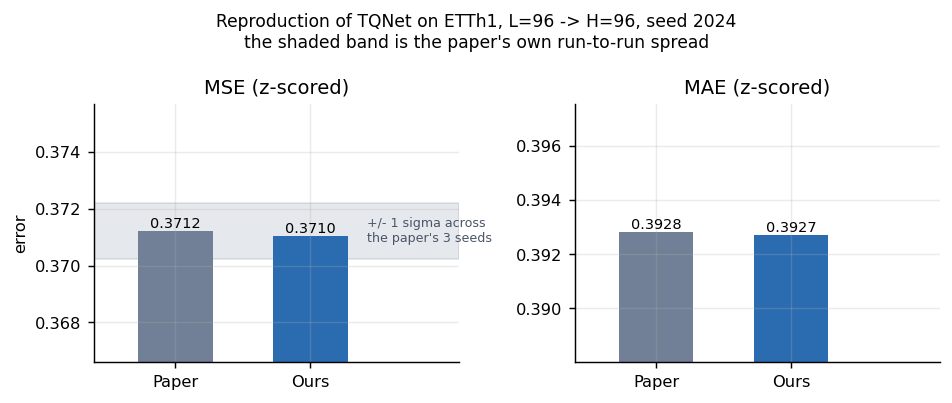
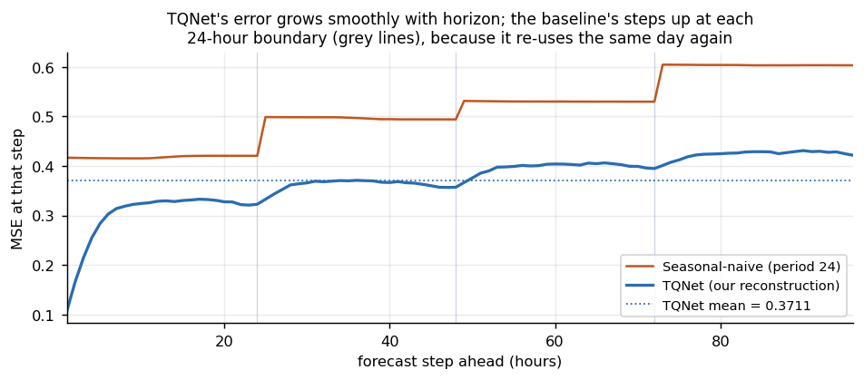
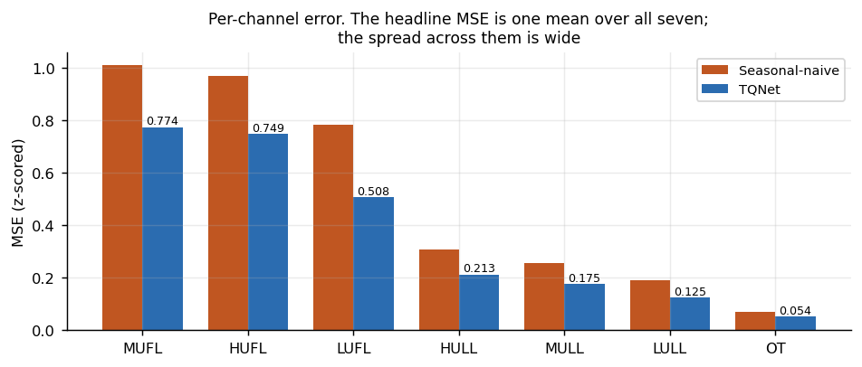
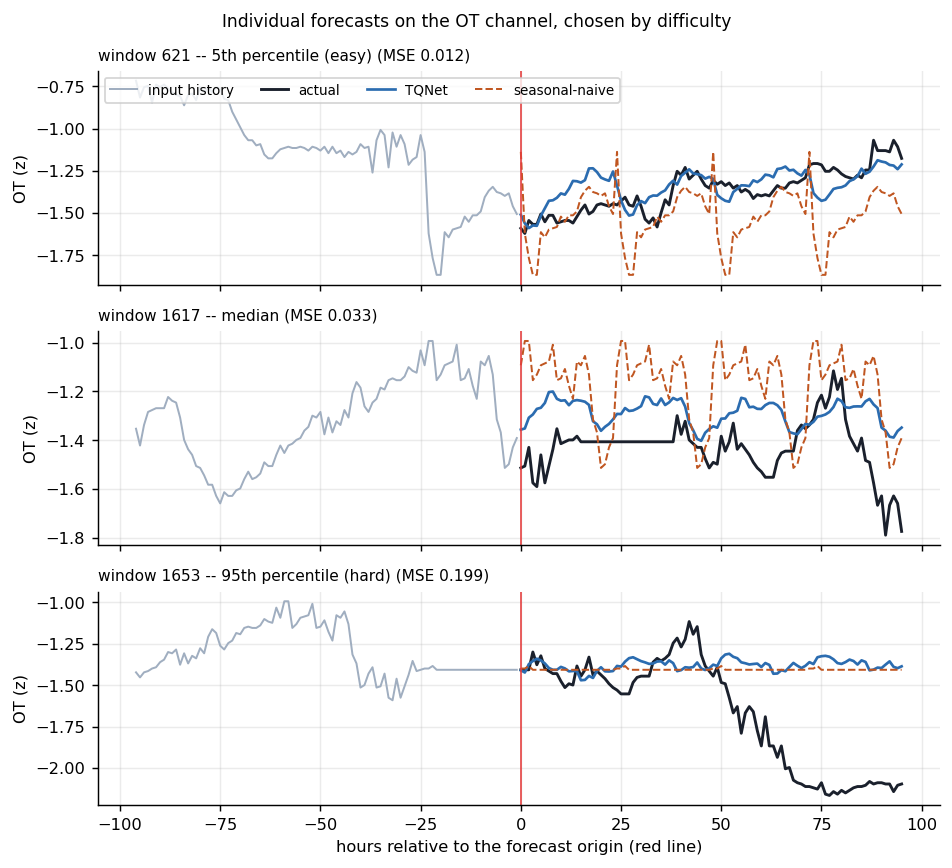
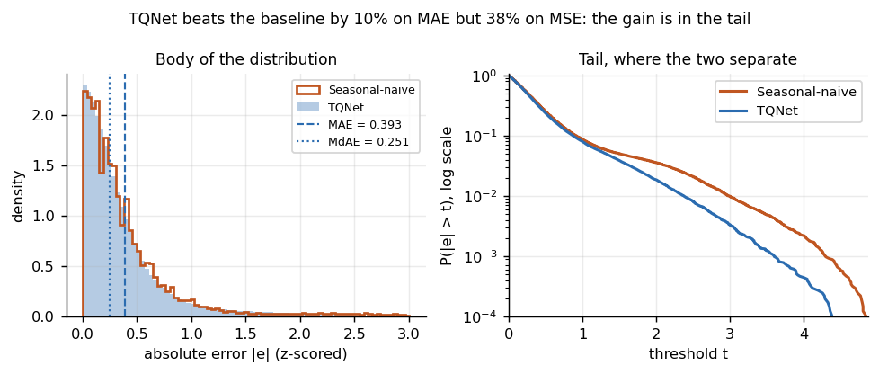

# Results -- TQNet reconstruction on ETTh1

Generated by `tools/make_report.py` from the run records in `results/runs/`. Do not edit by hand: re-run the script instead, or the numbers here will drift away from the runs they claim to describe.

Task type: **multivariate, supervised, deterministic point forecasting**. Seven channels in, seven channels out. Sampling frequency 1 hour, input window 96 hours, output window 96 hours, forecast origin advancing at stride 1 across the test split with a fixed model (rolling-origin evaluation).

### Target cell: ETTh1, multivariate, L=96 -> H=96, seed 2024

All figures are on **z-scored** data, over the **2,785 test windows** the split defines. MSE and MAE are the paper's metrics; RMSE and MdAE are the course's.

| Arm | MSE | MAE | RMSE | MdAE | Source |
|---|---|---|---|---|---|
| Paper (as printed, Table 5) | 0.371 | 0.393 | -- | -- | TQnet.pdf p. 15 |
| Paper (authors' own run) | 0.371217 | 0.392820 | -- | -- | `result_authors_reference.txt` |
| Seasonal-naive baseline (period 24) | 0.512225 | 0.433303 | 0.715699 | 0.260666 | `baseline-seasonal_naive_24-sna-h96-17854` |
| **Our reconstruction** | 0.371050 | 0.392724 | 0.609139 | 0.251260 | `reconstruction-TQNet-s2024-h96-178542634` |

#### Reproduction gap

| Metric | Authors' run | Ours | Difference | Relative | Paper's seed sigma | Gap / sigma |
|---|---|---|---|---|---|---|
| MSE | 0.371217 | 0.371050 | -0.000167 | -0.045% | 0.001 | 0.17x |
| MAE | 0.392820 | 0.392724 | -0.000096 | -0.024% | 0.000 | -- |

**Verdict on MSE:** reproduced: the gap is 0.17x the paper's own seed sigma, i.e. inside the run-to-run noise they measured.

The paper reports MAE sigma as 0.000 at this horizon, which is 0.0005 rounded down rather than literal determinism, so the MAE ratio above is not meaningful and only the MSE verdict should be read.

#### Against the baseline

TQNet reduces MSE by **27.6%** relative to a seasonal-naive forecast at the same period (24) on the same windows and the same scale. Both make the same daily-periodicity assumption, so this gap is what the network adds on top of knowing that ETTh1 repeats daily.

Note also that MAE / MdAE = 1.56 for the reconstruction. MdAE being well below MAE means the error distribution is right-skewed: most predictions are much better than the mean suggests, and the headline is carried by a minority of badly-missed windows.

### The paper's comparison set at H=96

Transcribed from Table 5, p. 15. The caption states these baseline numbers were **copied** from TimeXer, iTransformer and CycleNet rather than re-run, so each inherits its own paper's setup. They are context for our result, not a like-for-like comparison.

| Model | MSE | MAE |
|---|---|---|
| TQNet **(the paper's method)** | 0.371 | 0.393 |
| CycleNet | 0.375 | 0.395 |
| TimeXer | 0.382 | 0.403 |
| TimesNet | 0.384 | 0.402 |
| iTransformer | 0.386 | 0.405 |
| DLinear | 0.386 | 0.400 |
| MSGNet | 0.390 | 0.411 |
| PatchTST | 0.414 | 0.419 |
| Crossformer | 0.423 | 0.448 |
| SCINet | 0.654 | 0.599 |

TQNet's margin over the strongest baseline (CycleNet) is **-0.004 MSE**, against a run-to-run sigma of **0.001**.

### Environment deviations from the paper

The brief asks that differences between our numbers and the paper's be explained. These are the candidate explanations, recorded before the run rather than reached for afterwards.

| Aspect | Paper | Ours |
|---|---|---|
| Device | RTX 4090, 24 GB | cpu |
| Python | 3.8 (upstream README; now end-of-life) | 3.13.5 |
| PyTorch | unstated | 2.9.1 |
| numpy | unstated | 2.2.6 |
| pandas | unstated (code requires < 2.0) | 2.3.3 |
| Seed | 2024 | 2024 |

PyTorch and cuDNN version differences change floating-point reduction order and kernel selection, which is the ordinary reason two runs of identical code differ in the fourth decimal. Running on CPU rather than an RTX 4090 changes it further. Neither changes the model, the data or the protocol.

### Figures

**`figures/fig1_reproduction.png`** -- Our MSE and MAE against the authors' own run, with their three-seed spread drawn to scale.

**`figures/fig2_error_by_horizon_step.png`** -- MSE against how far ahead the forecast is, for TQNet and the baseline.

**`figures/fig3_per_channel.png`** -- Per-channel MSE, showing how uneven the headline mean is.

**`figures/fig4_forecast_examples.png`** -- Three actual forecasts on the OT channel, at the 5th, 50th and 95th percentile of difficulty.

**`figures/fig5_error_distribution.png`** -- Distribution and CDF of absolute error, explaining the MAE / MdAE gap.

